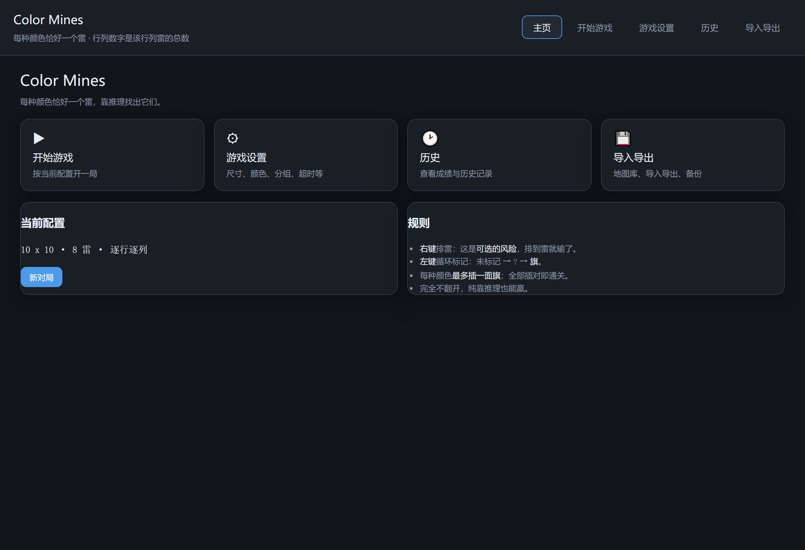
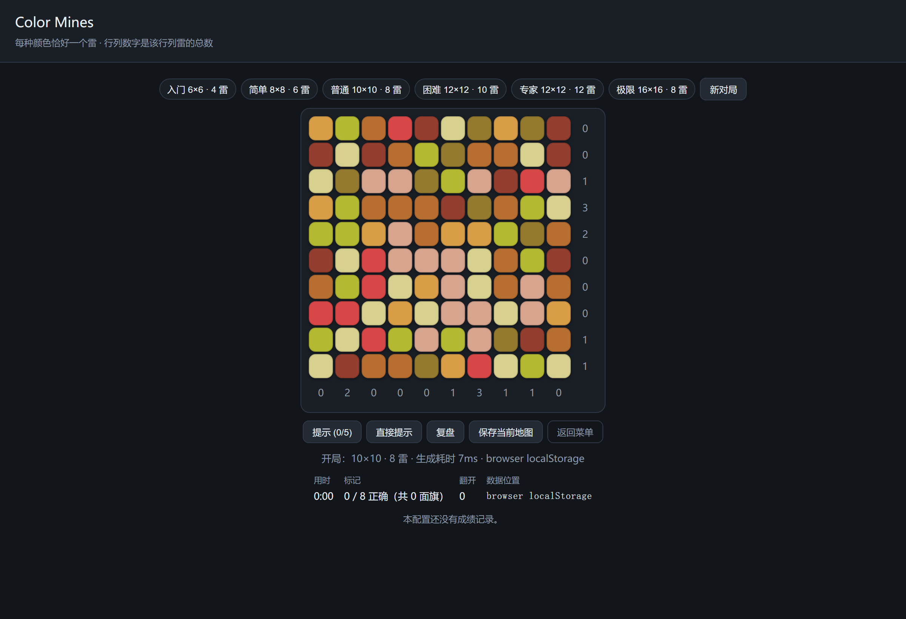
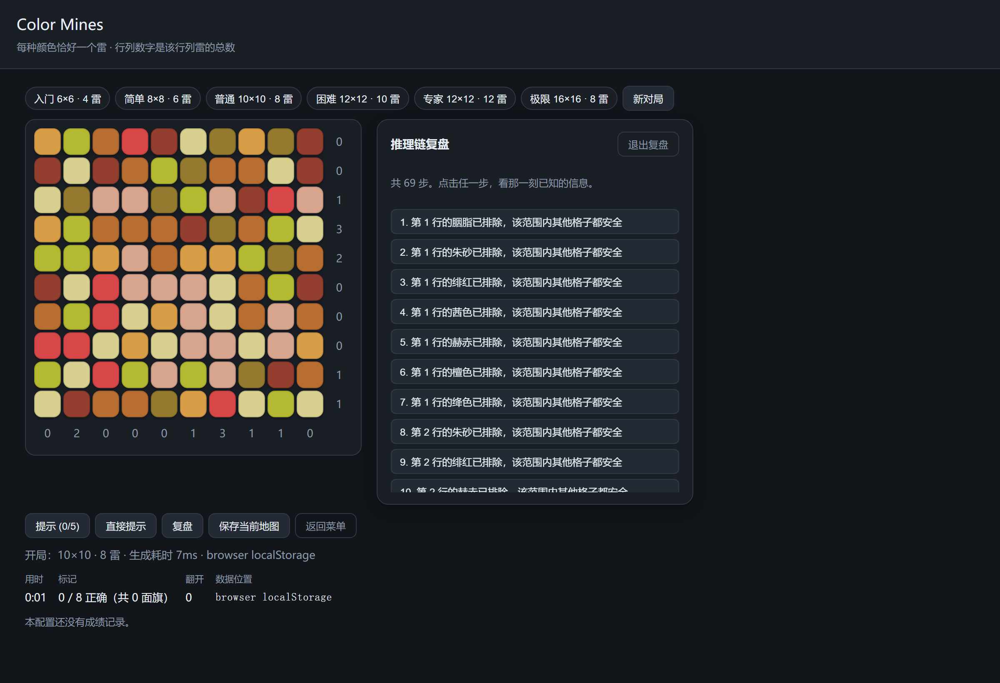
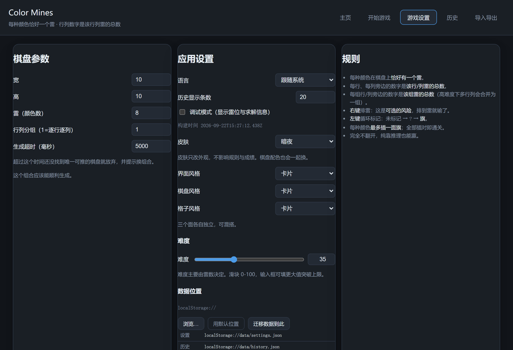
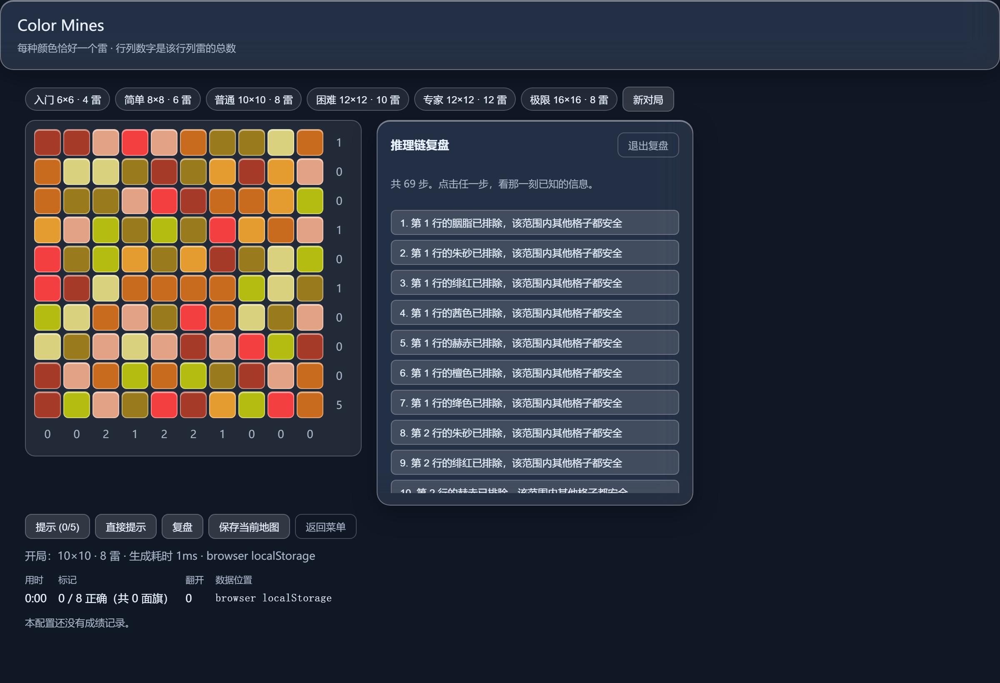

# Color Mines 颜色扫雷

> 每种颜色恰好一个雷。纯逻辑推理通关，不需要猜。

一个规则简单的扫雷变体：棋盘每格有一种颜色，**每种颜色恰好有一个雷**；每行每列旁边的
数字是该行/列雷的总数。颜色全程可见，需要找出的是「哪个格子是雷」。



## 下载

| 平台 | 文件 | 说明 |
|---|---|---|
| Windows 64 位 | `ColorMines-<版本>-x64-setup.exe` | NSIS 安装包，推荐 |
| Windows 64 位 | `ColorMines-<版本>-portable-win64.zip` | 免安装便携版，解压即用 |
| 浏览器 | 直接打开 `dist/index.html` | 无需安装，数据存 localStorage |

安装包与便携版都把用户数据放在统一的数据目录中（Windows 默认为
`%APPDATA%\app.colormines.desktop\data`），卸载后仍保留。

## 玩法

- **左键**循环标记：空白 → `?` → `⚑` → 空白（只标记，不会踩雷）
- **右键**排雷（挖开格子）是**可选的风险操作**——挖到雷就输，但完全不挖也能赢
- 按住左/右键**拖动**可连续标记 / 连续排雷
- 方向键移动，`F` 标记，`Ctrl/⌘ + N` 新对局
- 胜利条件：每种颜色的旗都插在它真正的雷上



## 特色

**必定可推理** — 生成器保证棋盘**唯一解**且逻辑求解器能推到底，不存在需要猜的局面。
量产验证中「推理停滞」始终为 0。

**推理链复盘** — 每步都给出具体依据（"第 3 行的朱砂已排除，该范围内其他格子都安全"），
点击可回放整条推导链。复盘时棋盘居左、推理链居右，同屏不翻页。



**提示有节制** — 每局有次数上限（简单配置 5 次，分组模式与大盘 3 次）。提示只说出颜色和
它所在的行/列带，不直接给出格子。另有「直接提示」直给答案，用过则本局不计分。

**任意难度组合** — 行、列、颜色数、行列分组均可自由组合，另有一条连续的难度刻度。
生成超时可在设置里调整（默认 5 秒）。

**皮肤系统** — 40 种颜色两两可辨；三个面（界面 / 棋盘 / 格子）各自独立选择材质：
简约、卡片、纸张、玻璃、云母、自定义图片，可混搭，也支持导入导出分享。





## 规则

- 棋盘每格有一种颜色；**每种颜色恰好有一个雷**
- 每行、每列旁边的数字 = 该行/列雷的总数
- 颜色**全程可见**，需要找出的是「哪个格子是雷」
- **每种颜色最多一面旗**
- 完全不挖开也能赢

## 档位与实测

| 档位 | 棋盘 | 雷 | 生成成功率 | 中位耗时 | 推理步数 |
|---|---|---|---|---|---|
| 入门 | 6×6 | 4 | 100% | 0ms | 26 |
| 简单 | 8×8 | 6 | 100% | 1ms | 46 |
| 普通 | 10×10 | 8 | 100% | 2ms | 76 |
| 困难 | 12×12 | 10 | 100% | 12ms | 113 |
| 专家 | 12×12 | 12 | 100% | 34ms | 115 |
| 极限 | 16×16 | 8 | 100% | 9ms | 150 |

## 构建

需要 Node 20+ 与 Rust 1.77+（仅桌面端需要 Rust）。

```bash
npm install

npm run dev          # 浏览器开发服务器
npm test             # 核心与数据层测试
npm run test:ui      # Playwright 界面测试
npm run build        # 产出 dist/

npm run tauri:build  # 产出安装包与 exe
python scripts/package-portable.py   # 产出便携版 zip
```

## 数据

用户数据保存在统一数据目录中：

```
data/
├── settings.json
├── history.json   (+ .bak / .bad)
├── maps/          保存的地图
├── logs/          app.log（滚动保留）
├── backups/       最近 10 份备份
└── skins/         导入的皮肤
```

写入采用「临时文件 → 校验 → 替换」；损坏的设置会有 `.bad` 备份，损坏的历史会尝试
`.bak`（恢复前逐条校验）。地图与皮肤均为带 `formatVersion` 的 JSON，附带 JSON Schema，
未知字段忽略、未知版本拒绝。

## 技术

- **核心**：TypeScript，无框架；求解器与生成器都在 Web Worker 中运行，界面不卡顿
- **桌面**：Tauri 2，Rust 侧只负责文件 I/O，游戏逻辑与 Web 完全共用同一份打包产物
- **单一实现**：不存在两套逻辑——这是前一次重写时最贵的一条教训

## 许可

[GNU Affero General Public License v3.0](LICENSE)（AGPL-3.0）。第三方依赖见 [THIRD-PARTY-NOTICES.md](THIRD-PARTY-NOTICES.md)。

## 更新日志

见 [CHANGELOG.md](CHANGELOG.md)。
